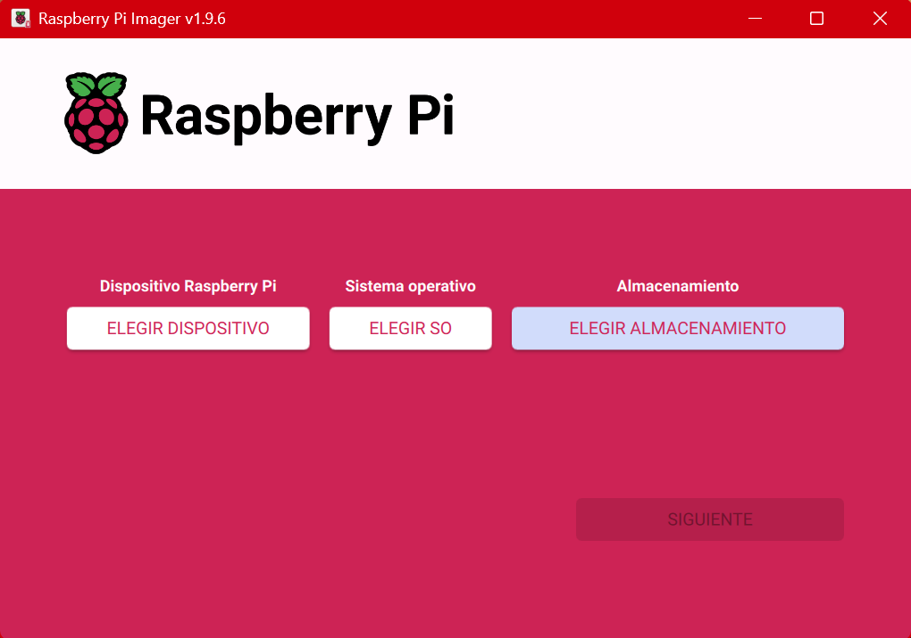

# Qr-Reader-OpenCv-Pizzbar-For-Raspberry-Pi-3
Short exercise for Qr catching and analysis by using Opencv and assertive guidelines to implement via Raspberry pi 3. this project is purelly introuceable to raspberry pi 3 and video-audio integration. User will be able to see the system working directly at the linux system or therefore, hearing from speaker.

this project is emulating the more common sounds of WALL-E: the famous robot which picks up trash from the uninhabitable world in the movie Wall-e.


# Main technologies used
- pyzbar - library for Qr recognition
- OpenCv2 - Ml library commonly used for drawing patterns
- Raspberry imager
- SD card formatter - free software to clean ssd memories.
- Raspberry pi 3.
- Python 3.

## key commands and procedures for how to connect and run the project in raspberry pi 3.

# Set raspberry SSH configuration
get the raspberry pi imager and introduce your ssd memory. let it recognize and set basic configurations for SSH connection. Navigate to the folder where the SSH key is saved, copy the fingerprint. download the operative system and set up properties.



# Connect the same network together with the raspberry
Open your raspberry pi desktop by using hdmi and mouse. navigate to available networks, and connect to the same the machine will use to send the project.

# Connect the rapsberry via SSH
search the raspberry ip which is connected to the common network.

```
ssh hostname@00.000.000.000
```

# Initiate into powershell - linux - SSH 
## What is this for:
We are creating the first folders and first files from <windows> disk to <linux> memory, its done this way because the files are inside windows folders and we need to pass them to raspberry by searching them locally.
Once ssh connection stablished through powershell windows console, raspberry communicates through linux console interface, waiting for first time project creation and files insertion. here we are downloading and installing fundamental files to get it work by enabling python environment and common dependencies needed.

powershell will enter to linux comand line to interact with raspberry system, once there, we should search the 
location where we want to place our folders mocking exactly the structure expected by the code, to get the program work correctly. the following commands will help to this task:

## 1. Create folders and copy files in raspberry pi system.

### Create folder from linux shell
```
mkdir ~/project_1
```
### Create and paste files or folders into linux system, using powershell and secure copy protocol (scp)
scp "C:\Users\yourUser\OneDrive\desktop\Pattern-reader-with-Cv-raspberry\requirements_rpi.txt" sebas@10.153.185.147:~/webrtc_server/

scp -r "C:\Users\yourUser\OneDrive\desktop\Pattern-reader-with-Cv-raspberry\src\server" sebas@10.153.185.147:~/webrtc_server/

## 2. Create and configure virtual environment.
we need to create the virtual environment each time we want to configure a new project, unless we want to use a global one. In this ocasion we are going to create a new one into the project root.

### Stand up at the project folder & move around-across the folders.
cd ~/webrtc_server
cd ..
### Create virtual environment.
python3 -m venv venv
### Activate scripts pointing to the project.
source venv/bin/activate

## 3. Install dependencies and tools.

### Install project dependencies
pip install --upgrade pip wheel setuptools etc etc etc
### Install project dependencies from requirements file.
pip install -r requirements_rpi.txt
### Install project dependencies from APT ubunto dependencie manager.
sudo apt update
sudo apt install python3-opencv -y
### Install and prepare compilation tools for video
sudo apt install -y ffmpeg v4l-utils libsrtp2-1 libsrtp2-dev
### Verify installed dependencies.
pip list

## 4. Connect camera, speaker or alternatives to USB.

### Verify devices.
lsusb
### Verify speaker power and performance by playing default test wav.
aplay -l
speaker-test -D plughw:1,0 -c2 -t wav
### For further info, we can list device details.
v4l2-ctl --list-devices

## 5. Prepare and get ready env to run

### Look up into any folder, make sure we are at the right project and path, look for <main.py>
ls -l <any folder>
### Run the pipeline.
python server/main.py

## 6. Troubleshooting

### What if something fails due to the lack of libreries that only can be installed with APT ubuntu?
- allow virtual environment uses the global apt python global env:
  rm -rf venv
  python3 -m venv venv --system-site-packages

- install all packages asked by OS, if it's not found from last requirements.txt instalation.
## need to delete or remove a file or folder from linux shell?
rm -rf ~/the_file_you_want_remove

# We want to gossyp other networks to jump up to other one?
nmcli dev wifi list

## Configure other available network by adding it to the list of autoasignable connections
take care with this configuration, you must be sure you are setting the right credentials, otherwise, if the system does not achieve to connect automatically, it will reject the connection and you will lose current communication through powershell. Its recommended to manipulate networks directly into the linux desktop system.

network={
    ssid="UTP"
    key_mgmt=NONE
    priority=1
} 
